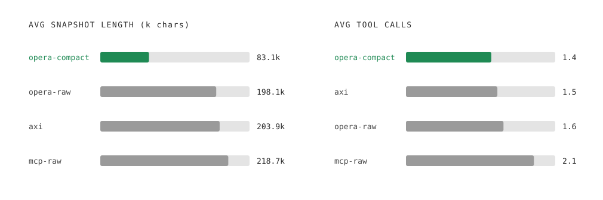

<picture>
  <source media="(prefers-color-scheme: dark)" srcset="images/opera-logo-dark.png">
  
</picture>

# Opera browser CLI - compact: token-efficient browser snapshots for AI agents

06.30.26

<picture>
  <source media="(prefers-color-scheme: dark)" srcset="images/opera-compact-benchmark-dark.svg">
  
</picture>

##  Abstract

**Opera browser CLI - compact** is the default snapshot format of [opera-browser-cli](https://github.com/operasoftware/opera-browser-cli), a browser-automation tool built for AI agents. Across 50 static pages spanning Wikipedia, GitHub, MDN, Python documentation, and the RFC Editor, **Opera browser CLI - compact** produces snapshots roughly 36% smaller than the raw accessibility output browser agents typically consume. On a 7-task agentic browser benchmark adapted from the [AXI suite](https://axi.md), an LLM agent driving **Opera browser CLI - compact** completes every task while spending 66% fewer input tokens than the closest competing format and 80% fewer than the unprocessed baseline, in shorter wall time. Pass rate is unchanged across all conditions.

**Opera browser CLI - compact** is a compression layer on top of three upstream projects that this paper credits and measures against. The sections below describe the transformation, the benchmarks, and the limits of what those benchmarks establish.

## 1\. Background

Browser-driving tools for language agents share a common shape: the page is captured as an accessibility-tree snapshot, returned to the model as text, and the model picks an element by id to drive the next action. The cost of every iteration is dominated by the size of that snapshot. opera-browser-cli inherits its place in this ecosystem from three upstream projects: chrome-devtools-mcp, opera-devtools-mcp, and chrome-devtools-axi.

[**chrome-devtools-mcp**](https://github.com/ChromeDevTools/chrome-devtools-mcp) (Google, Apache-2.0) is the Model Context Protocol server that drives a real Chrome browser. It is the source of the accessibility snapshot that every downstream tool starts from. An *accessibility tree* is the browser's semantic model of the page; each node carries a *role* and a set of attributes defined by the W3C [WAI-ARIA specification](https://www.w3.org/TR/wai-aria/). chrome-devtools-mcp serializes that tree as text: nodes labelled by ARIA role (`RootWebArea`, `StaticText`, `link`, …), each carrying attributes such as `url=`, `description=`, and a unique `uid=` reference the agent can act on. The role and attribute names used throughout this paper are standard ARIA terms drawn from that specification. In our benchmarks, this raw output is the `mcp-raw` baseline.

[**opera-devtools-mcp**](https://github.com/operasoftware/opera-devtools-mcp) (Apache-2.0) is Opera's fork of chrome-devtools-mcp. It adds four Opera Neon AI tools — `opera_chat`, `opera_do`, `opera_make`, `opera_research` — that let agents delegate work to Opera's built-in AI. The snapshot format is unchanged from upstream. The `mcp-raw` numbers reported below are the bytes opera-devtools-mcp returns, identical in shape to chrome-devtools-mcp's output.

**AXI** (Agent eXperience Interface; Kun Chen, [https://axi.md](https://axi.md)) is a design framework of ten principles for command-line tools intended for AI agents: token-efficient output, combined operations, contextual next-step hints, ambient session context, structured errors, definitive empty states, and others. Its reference browser implementation, [**chrome-devtools-axi**](https://github.com/kunchenguid/chrome-devtools-axi), wraps chrome-devtools-mcp in an AXI-shaped CLI: a persistent local bridge process, a compact `@uid` reference convention, TOON-encoded metadata, and a `help[]` block on every response that suggests next-step commands.

**opera-browser-cli** is a fork of chrome-devtools-axi that wraps opera-devtools-mcp instead of chrome-devtools-mcp. From AXI it inherits the CLI shape, the bridge architecture, the help-block convention, and the broad surface of commands. From opera-devtools-mcp it inherits the raw snapshot format and the Neon AI tools. **Opera browser CLI - compact** is the additional layer opera-browser-cli applies between the raw MCP output and the text the agent receives.

The contributions documented here are the specific transformation, the benchmark results, and the decision to apply the transformation by default.

## 2\. The problem

A typical browser-agent loop looks like:

```
open → inspect → identify element → act → inspect → extract → answer
```

Each `inspect` step pays the snapshot cost in input tokens. On dense pages the raw accessibility output can exceed a hundred thousand tokens. A multi-step task that re-snapshots after every action multiplies that cost across the trajectory.

**Opera browser CLI - compact** removes redundant bytes that do not add useful information for the agent, such as repeated labels, implied ARIA defaults, duplicate URL origins, whitespace-only nodes, and repeated citation links. This makes the page representation smaller while preserving the information the agent actually needs.

## 3\. What Opera browser CLI - compact does

**Opera browser CLI - compact** applies three layers of transformation, in order: structural clean-up, an output-length cap, and a URL lookup table.

### 3.1 Structural clean-up

Each transformation in this layer is applied independently to each line of the snapshot.

- **References are rewritten** from `uid=X_Y` form to `@X.Y` form, because the dot tokenises into fewer tokens than the underscore.  
- **Role names are shortened** where the long form carries no extra meaning: `RootWebArea` becomes `root`, `StaticText` becomes `text`, `DisclosureTriangle` becomes `disclosure`, and so on.  
- **Redundant attributes are stripped.** Most are values the [WAI-ARIA specification](https://www.w3.org/TR/wai-aria/) defines as implicit for the role and therefore recoverable: the `polite`/`assertive` live-region settings and `atomic` flag on `status` and `alert`, `relevant="additions text"` (the ARIA default for any live region), the selectable nature of `option` and `tab`, and the expandable-with-popup nature of `combobox`. A few attributes that do not affect which actions the agent can take are also dropped — `aria-orientation` and `aria-autocomplete` modes — on the grounds that they rarely inform navigation. Empty values (`valuetext=""`) and attributes made redundant by a sibling (`disableable` alongside `disabled`) are removed as well.  
- **Empty nodes are dropped** — line-break nodes, whitespace-only text, and text children that simply echo the accessible name of their parent.  
- **Headings become Markdown.** A node like `heading "Foo" level=2` is rewritten as `## Foo`, which is shorter and uses a format models already parse fluently.  
- **URLs are cleaned.** Same-origin URLs are stripped to their path (`https://en.wikipedia.org/wiki/Moon` becomes `/wiki/Moon` on a Moon page); cross-site tracking parameters (`utm_*`, `gclid`, `fbclid`, `msclkid`, etc.) are removed; `javascript:` and `data:` URLs that carry no actionable destination are dropped entirely.  
- **Repeated boilerplate is deduplicated.** Description strings repeated on every element of a list ("use arrow keys to navigate" and similar) are kept on first occurrence and elided thereafter.  
- **Fragments are merged.** Consecutive text nodes at the same indent — common in fragmented Wikipedia infobox rows — are collapsed into one line.  
- **Numeric attribute values are unquoted** — `level="2"` becomes `level=2`, saving the two quote characters per numeric attribute.

All transformations are deterministic and preserve addressability: every `@X.Y` reference remains a valid handle for subsequent tool calls.

### 3.2 A predictable default cap

opera-browser-cli truncates compact snapshots at **12,000 characters** by default. Raw snapshots cap at 16,000. The `--full` flag disables the cap entirely, and every truncated response carries a `help[]` entry telling the agent how to ask for the full snapshot if it needs more.

The cap is not a fixed token budget — pages compress to different sizes — but it bounds the worst case.

### 3.3 A URL lookup table

After clean-up and after truncation, URLs that appear multiple times are replaced with short `$uN` tokens, and a trailer lists each token's full value. Very long single-occurrence URLs — typically signed cloud URLs or data-encoded images — are also tokenised; the trailer reports only their byte size and a short preview rather than the full value.

The lookup table runs after the cap, so the trailer never references a URL absent from the body. The bytes that fit within the cap therefore carry page content rather than repeated URL strings.

The three layers compose as follows. Structural clean-up reduces the bytes required to represent the same content by roughly a third. The cap converts that reduction into an order-of-magnitude reduction on long pages, at the cost of completeness. The lookup table runs on the already-truncated body, so it does not change which content fits within the cap; it shortens repeated and oversized URLs in that body and reclaims those bytes in the final output, with a trailer that lists only URLs the agent can actually see.

## 4\. Worked example

### 4.1 Clean-up on a small page

`example.com` in raw mode:

```
uid=2_0 RootWebArea "Example Domain" url="https://example.com/"
  uid=2_1 heading "Example Domain" level="1"
  uid=2_2 StaticText "This domain is for use in documentation examples without needing permission. Avoid use in operations."
  uid=2_3 link "Learn more" url="https://iana.org/domains/example"
    uid=2_4 StaticText "Learn more"

```

The same page in compact mode:

```
@2.0 root "Example Domain" url="/"
  @2.1 # Example Domain
  @2.2 text "This domain is for use in documentation examples without needing permission. Avoid use in operations."
  @2.3 link "Learn more" url="https://iana.org/domains/example"
```

Changes visible in these five lines: the `uid=X_Y` → `@X.Y` reference rewrite, the Markdown heading, the shortened role name (`RootWebArea` → `root`), the same-origin URL collapsed to a single slash, and the removal of the echoed `"Learn more"` text node whose content was already carried by its parent link.

### 4.2 The URL lookup table on a citation-heavy page

The tail of the Moon Wikipedia article in compact mode, showing the tokenised citation URLs and the trailer:

```
    @8.324 link "[5]" url=$u7
    @8.328 link "Polar" description="Geographical pole" url="/wiki/Geographical_pole"
    @8.330 text " radius1736.0 km(0.2731 of Earth's)"
    @8.337 link "[5]" url=$u7
    @8.341 link "Flattening" url="/wiki/Flattening"
    @8.343 text "0.0012"
    @8.344 link "[5]" url=$u7
urls:
  $u1 /wiki/Natural_satellite
  $u2 /wiki/Light-second
  $u3 /wiki/Astronomical_unit
  $u4 /wiki/Lunar_distance_(astronomy)
  $u5 /wiki/Moon#cite_note-W06-1
  $u6 /wiki/Orbital_period
  $u7 /wiki/Moon#cite_note-NSSDC-7
```

Each `[5]` footnote would otherwise carry its full citation URL inline. The tokenised form costs three characters per occurrence; the full URL appears once in the trailer.

### 4.3 What the cap actually carries

The same page (Moon, capped output) under each mode, counting interactive elements — links, buttons, inputs, headings — visible within the snapshot:

| Mode | Cap (chars) | Bytes used | Interactive elements visible |
| :---- | :---- | :---- | :---- |
| `opera-compact` | 12,000 | 12,499 | **104** |
| `opera-raw` | 16,000 | 16,706 | 80 |

At roughly 25% less byte budget, the compact snapshot surfaces **30% more actionable elements**. Bytes that raw mode spends on echoed text, default ARIA attributes, and repeated origin prefixes are instead spent on content from further down the page. Both snapshots reach roughly the same depth in the document.

## 5\. Evaluation

Two benchmarks are reported, both implemented [in the opera-browser-cli repository](https://github.com/operasoftware/opera-browser-cli/tree/main/benchmarks): a static benchmark that measures the byte cost of CLI output without involving a language model, and an agentic benchmark that runs an LLM against a fixed set of browser tasks.

### 5.1 Static page-token benchmark

50 static pages — 10 each from Wikipedia, GitHub, MDN, Python docs, and the RFC Editor — opened by each tool in full (uncapped) mode, with tiktoken counting the output.

| Condition | Avg tokens | Median tokens | p95 tokens |
| :---- | :---- | :---- | :---- |
| `opera-compact` | **60,600** | **24,300** | **256,100** |
| `mcp-raw` | 94,700 | 45,000 | 391,300 |
| `opera-raw` | 94,900 | 45,100 | 381,400 |
| `axi` | 98,500 | 46,600 | 396,900 |

`mcp-raw` is the raw snapshot from opera-devtools-mcp; `opera-raw` is the same content through opera-browser-cli with compression disabled; `axi` is chrome-devtools-axi's full snapshot.

The three uncompressed conditions land within a few percent of one another, indicating they report substantively the same accessibility tree with thin CLI-shaped differences. The size gap to `opera-compact` is attributable to the compression layer rather than to differences between the underlying tools.

The gap is consistent across average, median, and p95 (roughly 36%, 46%, and 35% respectively). The p95 figure is the most relevant for production budgeting: a single 256k-token snapshot can exhaust a context window regardless of average page cost.

### 5.2 Agentic use benchmark

Seven browser tasks adapted from the [AXI bench-browser suite](https://github.com/kunchenguid/axi/tree/main/bench-browser), run by an LLM agent (`gpt-5.5`, medium reasoning effort) and graded pass/fail by an LLM judge. Each task is repeated five times per condition for a total of 35 runs per condition. The agent itself decides whether to ask for a full snapshot based on what it observes. Tasks span single-step lookups (page heading, fact in an infobox, repo metadata), multi-step navigation (follow a link, extract a value from the next page), and short investigations (recent issue titles, top of a long table).

| Condition | Pass | Avg input  tokens | Avg snapshot chars | Avg wall time \[s\] | Avg tool calls |
| :---- | :---- | :---- | :---- | :---- | :---- |
| **`opera-compact`** | **100%** | **36,300** | **83,100** | **6.8** | **1.4** |
| `opera-raw` | 100% | 107,500 | 198,100 | 8.5 | 1.6 |
| `axi` | 100% | 102,200 | 203,900 | 9.8 | 1.5 |
| `mcp-raw` | 100% | 179,200 | 218,700 | 9.4 | 2.1 |

All four conditions complete every task. The differences are in cost:

- **66% fewer input tokens than `opera-raw`** (107.5k → 36.3k), the closest condition.  
- **80% fewer input tokens than `mcp-raw`** (179.2k → 36.3k), the unprocessed baseline. `mcp-raw` also requires more tool calls per task (2.1 vs 1.4), compounding the per-call cost.  
- **\~30% lower wall time** (6.8 s vs 8.5–9.8 s).  
- `axi` sits between `opera-raw` and `opera-compact` on input tokens, indicating that the AXI CLI layer contributes savings independent of `opera-compact` compression layer. `opera-compact` is additive to that contribution rather than a substitute.

## 6\. Limitations

The results above apply to a specific evaluation setup:

- **Pass rate ceilings at 100%** across all four conditions on the 7-task suite. The benchmark therefore cannot detect whether compression introduces occasional task failures. The efficiency results are valid as measured; the reliability claim is bounded by the difficulty of the tasks.  
- **The static corpus is documentation-class.** All 50 pages are server-rendered, text-heavy reference material. Single-page applications, dashboards, and app-style UIs are not represented; per-byte reductions on those page types may differ.  
- **Single model, single run set.** Results use `gpt-5.5` at medium reasoning effort with `n=5` repeats per task. Variance, alternative models, and alternative reasoning settings were not measured.

## 7\. Related work

- **AXI** (Kun Chen, [https://axi.md](https://axi.md)) articulates the principle that agent-tool interfaces should be designed for agents from the start, not protocol-translated from human tools, and provides [chrome-devtools-axi](https://github.com/kunchenguid/chrome-devtools-axi) as a reference. **Opera browser CLI - compact** is an additional compression layer on top of that reference, not an alternative to it.  
- **chrome-devtools-mcp** (Google, Apache-2.0) — the upstream MCP server jointly responsible for the underlying snapshot format we compress.  
- **opera-devtools-mcp** (Apache-2.0) — our fork of chrome-devtools-mcp, adding the Opera Neon AI tools. Snapshot format is unchanged from upstream, which is what makes the `mcp-raw` comparison meaningful.  
- **TOON format** — used for the structured metadata blocks (`page:`, `help:`) in CLI output. Inherited from chrome-devtools-axi, not part of the snapshot-compression pipeline itself.

## 8\. Conclusion

**Opera browser CLI - compact** applies three transformations to the raw accessibility snapshot returned by opera-devtools-mcp: structural clean-up of nodes and attributes that are redundant under the role they appear in, a default 12,000-character cap on output length, and a URL lookup table that replaces repeated and very long URLs with short tokens. Together these transformations produce snapshots roughly 36% smaller per byte than the raw output, carry roughly 30% more interactive content within the default cap, and reduce LLM input tokens on a 7-task agentic benchmark by 66–80% relative to the nearest baseline, without changing pass rate.

The transformations remove only structure that is redundant under the role information already present in each node. Reference identifiers, interactive affordances, headings, and link destinations are preserved.

## References

- opera-browser-cli — [https://github.com/operasoftware/opera-browser-cli](https://github.com/operasoftware/opera-browser-cli)  
- opera-devtools-mcp — [https://github.com/operasoftware/opera-devtools-mcp](https://github.com/operasoftware/opera-devtools-mcp)  
- chrome-devtools-mcp — [https://github.com/ChromeDevTools/chrome-devtools-mcp](https://github.com/ChromeDevTools/chrome-devtools-mcp)  
- chrome-devtools-axi — [https://github.com/kunchenguid/chrome-devtools-axi](https://github.com/kunchenguid/chrome-devtools-axi)  
- AXI — [https://axi.md](https://axi.md)  
- AXI bench-browser — [https://github.com/kunchenguid/axi/tree/main/bench-browser](https://github.com/kunchenguid/axi/tree/main/bench-browser)

For any questions or clarifications, please reach out to press@opera.com

<picture>
  <source media="(prefers-color-scheme: dark)" srcset="images/opera-logo-dark.png">
  
</picture>